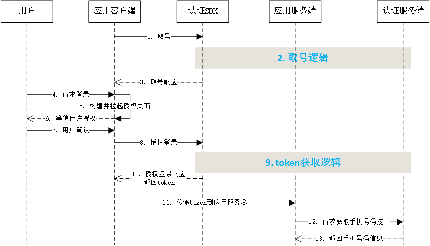

# 1. 接入指南

sdk技术问题沟通QQ群：609994083</br>

**注意事项：**

1. **认证取号服务必须打开蜂窝数据流量并且手机操作系统给予应用蜂窝数据权限才能使用**
2. **取号请求过程需要消耗用户少量数据流量（国外漫游时可能会产生额外的费用）**
3. **认证取号服务目前支持中国移动2/3/4G和中国电信4G**

## 1.1. 接入流程

**1.申请appid和appkey**

根据《开发者接入流程文档》，前往中国移动开发者社区（dev.10086.cn)，按照文档要求创建开发者账号并申请appid和appkey，并填写应用的包名和包签名。

**2.申请能力**

应用创建完成后，在能力配置页面上，勾选应用需要接入的能力类型，如一键登录，并配置应用的服务器出口IP地址。（如果在服务端需要用非对称加密方法对一些重要信息进行加密处理，请在能力配置页面填写RSA加密的公钥）

**3.添加appid白名单**

开发者在完成步骤1和步骤2后，将appid提供给移动认证工作人员，移动方将在2个工作日内将appid加入白名单，白名单添加完毕，开发者就可以开始联调对接。

**4.上线审核**

应用上线前，开发者需要将一键登录取号能力的场景所使用的授权页面（授权页面参考授权页面规范）提供给移动认证产品接口人，审核无误后可正式上线。

## 1.2. 开发流程

**第一步：下载SDK及相关文档**

请在开发者群或官网下载最新的SDK包

**第二步：搭建开发环境**

jar包集成方式：

1. 在Eclipse/AS中建立你的工程。 
2. 将`*.jar`拷贝到工程的libs目录下，如没有该目录，可新建。

如果使用android studio进行开发，在app的主module的build.gradle中加入依赖配置：

```
implementation 'com.cmictop.sso:sdk:9.0.5'
```

注：其中9.0.5是一键登录对应的SDK的版本号


**第三步：开始使用移动认证SDK**

**[1] AndroidManifest.xml设置**

添加必要的权限支持: 

```java
<uses-permission android:name="android.permission.INTERNET" />
<uses-permission android:name="android.permission.READ_PHONE_STATE" />
<uses-permission android:name="android.permission.ACCESS_WIFI_STATE" />
<uses-permission android:name="android.permission.ACCESS_NETWORK_STATE" />
<uses-permission android:name="android.permission.CHANGE_NETWORK_STATE" />
```

权限说明：

| 权限                 | 说明                                       |
| -------------------- | ------------------------------------------ |
| INTERNET             | 允许应用程序联网，用于访问网关和认证服务器 |
| READ_PHONE_STATE     | 获取imsi用于判断双卡和换卡                 |
| ACCESS_WIFI_STATE    | 允许程序访问WiFi网络状态信息               |
| ACCESS_NETWORK_STATE | 获取网络状态，判断是否数据、wifi等         |
| CHANGE_NETWORK_STATE | 允许程序改变网络连接状态                   |

**[2] 创建一个AuthnHelper实例。**

`AuthnHelper`是SDK的功能入口，所有的接口调用都得通过AuthnHelper进行调用。因此，调用SDK，首先需要创建一个AuthnHelper实例

**示例代码：**

```java
public void onCreate(Bundle savedInstanceState) {
    super.onCreate(savedInstanceState);
    mContext = this;    
    ……
    mAuthnHelper = AuthnHelper.getInstance(mContext);
    }
```
**方法原型：**

```java
public static AuthnHelper getInstance(Context context)
```

**参数说明：**

| 参数    | 类型    | 说明                                               |
| ------- | ------- | -------------------------------------------------- |
| context | Context | 调用者的上下文环境，其中activity中this即可以代表。 |

**[3] 实现回调。**

所有的SDK接口调用，都会传入一个回调，用于接收SDK返回的调用结果。结果以`JsonObject`的形式传递，`TokenListener`的实现示例代码如下：

**注意：在9.0.5以及以后版本，该回调方法会被sdk抛到主线程中调用**

```java
mListener = new TokenListener() {
    @Override
    public void onGetTokenComplete(JSONObject jObj) {
        if (jObj != null) {
            mResultString = jObj.toString();
            mResultDialog.setResult(StringFormat.logcatFormat(mResultString));
            if (jObj.has("token")) {
                mtoken = jObj.optString("token");
            }
        }
    }
};
```
**[4] 混淆策略**

请避免混淆一键登录SDK，在Proguard混淆文件中增加以下配置：

```java
-dontwarn com.cmic.sso.sdk.**
-keep public class com.cmic.sso.sdk.*{;}
```

<div STYLE="page-break-after: always;"></div>

# 2. 一键登录&本机号码校验

## 2.1. 准备工作

在中国移动开发者社区进行以下操作：

1. 获得appid和appkey；
2. 勾选一键登录能力；
3. 配置应用服务器的出口ip地址

## 2.2. 流程说明 



## 2.3. 取号请求

本方法用于发起取号请求，SDK完成网络判断、蜂窝数据网络切换等操作并缓存凭证scrip。

**取号方法原型：**

```java
public void getPhoneInfo(final String appId, 
                         final String appKey, 
                         final TokenListener listener)
```

**参数说明：**

| 参数     | 类型          | 说明                                                         |
| :------- | :------------ | :----------------------------------------------------------- |
| appId    | String        | 应用的AppID，在开发者社区创建应用时获取                      |
| appkey   | String        | 应用密钥，在开发者社区创建应用时获取                         |
| listener | TokenListener | TokenListener为回调监听器，是一个java接口，需要调用者自己实现；TokenListener是接口中的认证登录token回调接口，OnGetTokenComplete是该接口中唯一的抽象方法，即void OnGetTokenComplete(JSONObject  jsonobj) |

**返回说明：**

OnGetTokenComplete的参数JSONObject，含义如下：

| 参数          | 类型   | 说明                          |
| ------------- | ------ | ----------------------------- |
| resultCode    | String | 接口返回码，“103000”为成功。  |
| desc          | String | 成功标识，true为成功。        |
| securityphone | String | 手机号码掩码，如“138XXXX0000” |

**示例代码**

```java
/***
判断和获取READ_PHONE_STATE权限逻辑
***/   

//创建AuthnHelper实例
public void onCreate(Bundle savedInstanceState) {
    super.onCreate(savedInstanceState);
    mContext = this;    
    ……
    mAuthnHelper = AuthnHelper.getInstance(mContext);
    }

//实现取号回调
mListener = new TokenListener() {
    @Override
    public void onGetTokenComplete(JSONObject jObj) {
        …………	// 应用接收到回调后的处理逻辑
    }
};

//调用取号方法
mAuthnHelper.getPhoneInfo(APP_ID, APP_KEY, mListener);
```

## 2.4. 创建授权页（一键登录）

为了确保用户在登录过程中将手机号码信息授权给开发者使用的知情权，一键登录需要开发者提供授权页登录页面供用户授权确认。开发者在调用授权登录方法前，必须弹出授权页，明确告知用户当前操作会将用户的本机号码信息传递给应用。授权页面的设计、布局、生成、弹出和消失，由开发者自行处理，但必须遵守移动认证授权页面设计规范。

注1：如果开发者需要使用**一键登录**服务，必须按照规定创建授权页面

注2：**本机号码校验**不需要创建授权页面，可以直接跳过2.4章

### 2.4.1. 页面规范细则

1、页面必须包含登录/注册按钮，授权登录方法`loginAuth`必须绑定该按钮使用。

2、登录按钮文字描述必须包含“登录”或“注册”等文字，不得诱导用户授权。

3、页面需要提示应用获取到的是用户的本机号码，例如，可以在页面显示本机号码的掩码（securityphone），或者提示用户将使用“本机号码”作为账号登录或注册。

4、页面必须包含移动认证协议条款，其中：

​	条款名称：《中国移动认证服务条款》

​	条款页面地址：https://wap.cmpassport.com/resources/html/contract.html

5、应用在上线前需将满足上述1~4的授权页面（正式上线版的）截图提供给产品接口人审核。

6、应用后续升级时，如果授权页面有较大改动（针对1~4内容进行修改），需将改动的授权页面截图提供给产品接口人审核。

7、对于未遵照1~4设计要求，或通过技术手段故意屏蔽不弹出授权页面但获得调用接口凭证token的行为，能力提供方有权限制APP一键登录取号能力的使用，待整改后再恢复提供服务。

### 2.4.3. 构建授权页面

授权登录页面由开发者设计和构建，在构建前，需调用SDK提供的授权页埋点记录方法。

**埋点记录方法原型**

```java
public void recordAuthEvent(String mAppId)
```

**参数说明**

| 参数   | 类型   | 说明        |
| :----- | :----- | :---------- |
| mAppId | String | 应用的AppID |

## 2.5. 授权请求

取号请求成功后，应用在等待用户授权后，调用授权请求方法，获取取号token

**请求示例代码：**

```java
//1.调用取号方法getPhoneInfo

//2.实现回调
mListener = new TokenListener() {
    @Override
    public void onGetTokenComplete(JSONObject jObj) {
        …………	// 应用接收到回调后的处理逻辑
    }
};


//3.用户点击授权按钮时，调用loginAuth方法，传入应用定义的uaAuthactivity，获取token
    mAuthnHelper.loginAuth(Constant.APP_ID, Constant.APP_KEY, mListener);
    ……
```

**授权方法原型：**

```java
public void loginAuth(final String appId, 
                      final String appKey, 
                      final TokenListener listener)
```

**参数说明：**

| 参数     | 类型          | 说明                                                         |
| :------- | :------------ | :----------------------------------------------------------- |
| appId    | String        | 应用的AppID                                                  |
| appkey   | String        | 应用密钥                                                     |
| listener | TokenListener | TokenListener为回调监听器，是一个java接口，需要调用者自己实现；TokenListener是接口中的认证登录token回调接口，OnGetTokenComplete是该接口中唯一的抽象方法，即void OnGetTokenComplete(JSONObject  jsonobj) |

**返回说明：**

TokenListener的参数JSONObject，含义如下：

| 参数        | 类型   | 说明                                                         |
| ----------- | ------ | ------------------------------------------------------------ |
| resultCode  | String | 接口返回码，“103000”为成功                                   |
| authType    | String | 登录方式：1：WIFI下网关鉴权</br>2：网关鉴权</br>3：其他      |
| authTypeDes | String | 登录方式描述                                                 |
| token       | String | 成功时返回：临时凭证，token有效期2min，一次有效；同一用户（手机号）10分钟内获取token且未使用的数量不超过30个 |
| openId      | String | 成功时返回：用户身份唯一标识。（uaAuthActivity传入null时，不返回） |

## 2.6. 获取手机号码（服务端）

开发者获取token后，需要将token传递到应用服务器，由应用服务器发起获取用户手机号接口的调用。

调用本接口，必须保证：

1. token在有效期内。（2分钟）
2. token还未使用过。
3. 应用服务器出口IP地址在开发者社区中配置正确。
4. 如果使用RSA加密，确保应用的公钥在开发者社区正确填写。

**接口说明：**

请求地址：https://www.cmpassport.com/unisdk/rsapi/loginTokenValidate

协议： HTTPS 

请求方法： POST+json,Content-type设置为application/json

**参数说明：**

1、json形式的报文交互必须是标准的json格式

2、发送时请设置content type为 application/json

3、参数类型都是String

**请求参数**

| 参数                | 是否必填 | 说明                                                         |
| :------------------ | :------: | :----------------------------------------------------------- |
| version             |    是    | 填2.0                                                        |
| msgid               |    是    | 标识请求的随机数即可(1-36位)                                 |
| systemtime          |    是    | 请求消息发送的系统时间，精确到毫秒，共17位，格式：20121227180001165 |
| strictcheck         |    是    | 暂时填写"0"，填写“1”时，将对服务器IP白名单进行强校验（后续将强制要求IP强校验） |
| appid               |    是    | 业务在统一认证申请的应用id                                   |
| expandparams        |    否    | 扩展参数                                                     |
| token               |    是    | 需要解析的凭证值。                                           |
| sign                |    是    | 当**encryptionalgorithm≠"RSA"**时，sign = MD5(appid + version + msgid + systemtime + strictcheck + token + appkey)（注：“+”号为合并意思，不包含在被加密的字符串中），输出32位大写字母；</br>当**encryptionalgorithm="RSA"**，业务端RSA私钥签名（appid+token）, 服务端使用业务端提供的公钥验证签名（公钥可以在开发者社区配置）。 |
| encryptionalgorithm |    否    | 推荐使用。开发者如果需要使用非对称加密算法时，填写“RSA”。（当该值不设置为“RSA”时，执行MD5签名校验） |

**响应参数**

| 参数         | 说明                                                         |
| ------------ | ------------------------------------------------------------ |
| inresponseto | 对应的请求消息中的msgid                                      |
| systemtime   | 响应消息发送的系统时间，精确到毫秒，共17位，格式：20121227180001165 |
| resultcode   | 返回码                                                       |
| msisdn       | 表示手机号码，如果加密方式为RSA，应用需要用私钥进行解密      |

## 2.7. 本机号码校验（服务端）

开发者获取token后，需要将token传递到应用服务器，由应用服务器发起本机号码校验接口的调用。

调用本接口，必须保证：

1. token在有效期内（2分钟）
2. token还未使用过
3. 应用服务器出口IP地址在开发者社区中配置正确。

对于本机号码校验，需要注意：

1. 本产品属于收费业务，开发者未签订服务合同前，每天总调用次数有限，详情可咨询商务。
2. 签订合同后，将不在提供每天免费的测试次数。

**接口说明：**

请求地址： https://www.cmpassport.com/openapi/rs/tokenValidate

协议： HTTPS

请求方法： POST+json,Content-type设置为application/json

**参数说明：**

1、json形式的报文交互必须是标准的json格式

2、发送时请设置content type为 application/json

3、参数类型都是String

**请求参数**

| 参数          | 层级  | 是否必填                     | 说明                                                         |
| ------------- | ----- | ---------------------------- | ------------------------------------------------------------ |
| **header**    | **1** | 是                           |                                                              |
| version       | 2     | 是                           | 版本号,初始版本号1.0,有升级后续调整                          |
| msgId         | 2     | 是                           | 使用UUID标识请求的唯一性                                     |
| timestamp     | 2     | 是                           | 请求消息发送的系统时间，精确到毫秒，共17位，格式：20121227180001165 |
| appId         | 2     | 是                           | 应用ID                                                       |
| **body**      | **1** | 是                           |                                                              |
| openType      | 2     | 否，requestertype字段为0时是 | 运营商类型：</br>1:移动;</br>2:联通;</br>3:电信;</br>0:未知  |
| requesterType | 2     | 是                           | 请求方类型：</br>0:APP；</br>1:WAP                           |
| message       | 2     | 否                           | 接入方预留参数，该参数会透传给通知接口，此参数需urlencode编码 |
| expandParams  | 2     | 否                           | 扩展参数格式：param1=value1\|param2=value2  方式传递，参数以竖线 \| 间隔方式传递，此参数需urlencode编码。 |
| keyType       | 2     | 否                           | 手机号码加密方式：</br>0:默认phonenum采用sha256加密，sign采用HMACSHA256算法</br>1:RSA加密（暂未支持）</br>（注：keyType=1时，phonenum和sign均使用RSA，keyType不填或非1、0时按keyType=0处理） |
| phoneNum      | 2     | 是                           | 待校验的手机号码的64位sha256值，字母大写。（手机号码 + appKey + timestamp， “+”号为合并意思）（注：建议开发者对用户输入的手机号码的格式进行校验，增加校验通过的概率） |
| token         | 2     | 是                           | 身份标识，字符串形式的token                                  |
| sign          | 2     | 是                           | 签名，HMACSHA256( appId + msgId + phonNum + timestamp + token + version)，输出64位大写字母 （注：“+”号为合并意思，不包含在被加密的字符串中，appkey为秘钥, 参数名做自然排序（Java是用TreeMap进行的自然排序）） |

**响应参数**

| 参数         | 层级  | 说明                                                         |
| ------------ | ----- | :----------------------------------------------------------- |
| **header**   | **1** |                                                              |
| msgId        | 2     | 对应的请求消息中的msgid                                      |
| timestamp    | 2     | 响应消息发送的系统时间，精确到毫秒，共17位，格式：20121227180001165 |
| appId        | 2     | 应用ID                                                       |
| resultCode   | 2     | 平台返回码                                                   |
| **body**     | **1** |                                                              |
| resultDesc   | 2     | 平台返回码                                                   |
| message      | 2     | 接入方预留参数，该参数会透传给通知接口，此参数需urlencode编码 |
| accessToken  | 2     | 使用短验辅助服务的凭证，当resultCode返回为001时，并且该appid在开发者社区配置了短验辅助功能时返回该参数。accessToken有效时间为5min，一次有效。 |
| expandParams | 2     | 扩展参数格式：param1=value1\|param2=value2  方式传递，参数以竖线 \| 间隔方式传递，此参数需urlencode编码。 |

**请求示例代码：**

```
{
    body =     {
        openType = 1;
        phoneNum =0A2050AC434A32DE684745C829B3DE570590683FAA1C9374016EF60390E6CE76;
        requesterType = 0;
        sign = 87FCAC97BCF4B0B0D741FE1A85E4DF9603FD301CB3D7100BFB5763CCF61A1488;
        token = STsid0000001517194515125yghlPllAetv4YXx0v6vW2grV1v0votvD;
    };
    header =     {
        appId = 3000******76;
        msgId = f11585580266414fbde9f755451fb7a7;
        timestamp = 20180129105523519;
        version = "1.0";
    };
}
```

<div STYLE="page-break-after: always;"></div>

<div STYLE="page-break-after: always;"></div>

# 3. SDK方法说明

## 3.1. 获取管理类的实例对象

### 3.1.1. 方法描述

获取管理类的实例对象

**原型**

```java
public static AuthnHelper getInstance(Context context)
```

### 3.1.2. 参数说明

| 参数      | 类型      | 说明                              |
| ------- | ------- | ------------------------------- |
| context | Context | 调用者的上下文环境，其中activity中this即可以代表。 |

## 3.2. 取号请求

### 3.2.1. 方法描述

本方法用于发起取号请求，SDK完成网络判断、蜂窝数据网络切换等操作并缓存凭证scrip。

### 3.2.2. 参数说明

**请求参数**

| 参数       | 类型            | 说明                                       |
| :------- | :------------ | :--------------------------------------- |
| appId    | String        | 应用的AppID                                 |
| appkey   | String        | 应用密钥                                     |
| listener | TokenListener | TokenListener为回调监听器，是一个java接口，需要调用者自己实现；TokenListener是接口中的认证登录token回调接口，OnGetTokenComplete是该接口中唯一的抽象方法，即void OnGetTokenComplete(JSONObject  jsonobj) |

**响应参数**

OnGetTokenComplete的参数JSONObject，含义如下：

| 参数          | 类型   | 说明                          |
| ------------- | ------ | ----------------------------- |
| resultCode    | String | 接口返回码，“103000”为成功。  |
| desc          | String | 成功标识，true为成功。        |
| securityphone | String | 手机号码掩码，如“138XXXX0000” |

### 3.2.3. 示例

**请求示例代码**

```java
/***
判断和获取READ_PHONE_STATE权限逻辑
***/   

//创建AuthnHelper实例
public void onCreate(Bundle savedInstanceState) {
    super.onCreate(savedInstanceState);
    mContext = this;    
    ……
    mAuthnHelper = AuthnHelper.getInstance(mContext);
    }

//实现取号回调
mListener = new TokenListener() {
    @Override
    public void onGetTokenComplete(JSONObject jObj) {
        …………	// 应用接收到回调后的处理逻辑
    }
};

//调用取号方法
mAuthnHelper.getPhoneInfo(APP_ID, APP_KEY, mListener);
```

**响应示例代码**

```
{
	"resultCode":"103000",
	"desc":"true",
	"securityphone:"138XXXX0000"
}
```

## 3.3. 授权请求

### 3.3.1. 方法描述

取号请求成功后，应用在等待用户授权后，调用授权请求方法，获取取号token

**授权方法原型：**

```java
public void loginAuth(final String appId, 
                      final String appKey, 
                      final TokenListener listener)
```

### 3.3.2. 参数说明

**参数说明：**

| 参数     | 类型          | 说明                                                         |
| :------- | :------------ | :----------------------------------------------------------- |
| appId    | String        | 应用的AppID                                                  |
| appkey   | String        | 应用密钥                                                     |
| listener | TokenListener | TokenListener为回调监听器，是一个java接口，需要调用者自己实现；TokenListener是接口中的认证登录token回调接口，OnGetTokenComplete是该接口中唯一的抽象方法，即void OnGetTokenComplete(JSONObject  jsonobj) |

**返回说明：**

TokenListener的参数JSONObject，含义如下：

| 参数        | 类型   | 说明                                                         |
| ----------- | ------ | ------------------------------------------------------------ |
| resultCode  | String | 接口返回码，“103000”为成功                                   |
| authType    | String | 登录方式：1：WIFI下网关鉴权</br>2：网关鉴权</br>3：其他      |
| authTypeDes | String | 登录方式描述                                                 |
| token       | String | 成功时返回：临时凭证，token有效期2min，一次有效；同一用户（手机号）10分钟内获取token且未使用的数量不超过30个 |
| openId      | String | 成功时返回：用户身份唯一标识。                               |

### 3.3.3. 示例

```java
//1.调用取号方法getPhoneInfo

//2.实现回调
mListener = new TokenListener() {
    @Override
    public void onGetTokenComplete(JSONObject jObj) {
        …………	// 应用接收到回调后的处理逻辑
    }
};


//3.用户点击授权按钮时，调用loginAuth方法，传入应用定义的uaAuthactivity，获取token
    mAuthnHelper.loginAuth(Constant.APP_ID, Constant.APP_KEY, mListener);
    ……
```

## 3.4. 设置取号超时

### 3.4.1. 方法描述

设置取号超时时间，默认为8000毫秒

**原型**

```java
public void setTimeOut(long timeOut)
```

###3.4.2. 参数说明

**请求参数**

| 参数    | 类型 | 说明                       |
| ------- | ---- | -------------------------- |
| timeOut | long | 设置超时时间（单位：毫秒） |

**响应参数**

无


## 3.5. 获取网络状态和运营商类型

### 3.5.1. 方法描述

本方法用于获取用户当前的网络环境和运营商

**原型**

```java
public JSONObject getNetworkType(Context context)
```

### 3.5.2. 参数说明

**请求参数**

| 参数    | 类型    | 说明       |
| ------- | ------- | ---------- |
| context | Context | 上下文对象 |

**响应参数**

参数JSONObject，含义如下：

| 参数         | 类型   | 说明                                                         |
| ------------ | ------ | ------------------------------------------------------------ |
| operatortype | String | 运营商类型：</br>1.移动流量；</br>2.联通流量；</br>3.电信流量 |
| networktype  | String | 网络类型：</br>0.未知；</br>1.流量；</br>2.wifi；</br>3.数据流量+wifi |

## 3.6. 删除临时取号凭证

### 3.6.1. 方法描述

开发者取号或者授权成功后，SDK将取号的一个临时凭证缓存在本地，缓存允许用户在未开启蜂窝网络时成功取号。开发者可以使用本方法删除该缓存凭证。

**原型**

```java
public void delScrip()
```

<div STYLE="page-break-after: always;"></div>

# 4. 服务端接口说明

## 4.1. 获取手机号码接口

业务平台或服务端携带用户授权成功后的token来调用认证服务端获取用户手机号码等信息。

### 4.1.1. 接口说明

**请求地址：**https://www.cmpassport.com/unisdk/rsapi/loginTokenValidate

**协议：** HTTPS 

**请求方法：** POST+json,Content-type设置为application/json

**注意：开发者需到开发者社区填写服务端出口IP地址后才能正常使用**

</br>

### 4.1.2. 参数说明

1、json形式的报文交互必须是标准的json格式

2、发送时请设置content type为 application/json

3、参数类型都是String

**请求参数**

| 参数                | 是否必填 | 说明                                                         |
| :------------------ | :------: | :----------------------------------------------------------- |
| version             |    是    | 填2.0                                                        |
| msgid               |    是    | 标识请求的随机数即可(1-36位)                                 |
| systemtime          |    是    | 请求消息发送的系统时间，精确到毫秒，共17位，格式：20121227180001165 |
| strictcheck         |    是    | 暂时填写"0"，填写“1”时，将对服务器IP白名单进行强校验（后续将强制要求IP强校验） |
| appid               |    是    | 业务在统一认证申请的应用id                                   |
| expandparams        |    否    | 扩展参数                                                     |
| token               |    是    | 需要解析的凭证值。                                           |
| sign                |    是    | 当**encryptionalgorithm≠"RSA"**时，sign = MD5(appid + version + msgid + systemtime + strictcheck + token + appkey)（注：“+”号为合并意思，不包含在被加密的字符串中），输出32位大写字母；</br>当**encryptionalgorithm="RSA"**，业务端RSA私钥签名(appid+token), 服务端使用业务端提供的公钥验证签名（公钥可以在开发者社区配置）。 |
| encryptionalgorithm |    否    | 推荐使用。开发者如果需要使用非对称加密算法时，填写“RSA”。（当该值不设置为“RSA”时，执行MD5签名校验） |

**响应参数**

| 参数         | 说明                                                         |
| ------------ | ------------------------------------------------------------ |
| inresponseto | 对应的请求消息中的msgid                                      |
| systemtime   | 响应消息发送的系统时间，精确到毫秒，共17位，格式：20121227180001165 |
| resultcode   | 返回码                                                       |
| msisdn       | 表示手机号码，如果加密方式为RSA，应用需要用私钥进行解密      |

### 4.1.3. 示例

**请求示例**

```
{
    appid = 3000******76; 
    msgid = 335e06a28f064b999d6a25e403991e4c;
    sign = 213EF8D0CC71548945A83166575DFA68;
    strictcheck = 0;
    systemtime = 20180129112955435;
    token = STsid0000001517196594066OHmZvPMBwn2MkFxwvWkV12JixwuZuyDU;
    version = "2.0";
}
```

**响应示例**

```
{
    inresponseto = 335e06a28f064b999d6a25e403991e4c;
    msisdn = 14700000000;
    resultCode = 103000;
    systemtime = 20180129112955477;
}
```

## 4.2. 本机号码校验

开发者获取token后，需要将token传递到应用服务器，由应用服务器发起本机号码校验接口的调用。

调用本接口，必须保证：

1. token在有效期内（2分钟）
2. token还未使用过
3. 应用服务器出口IP地址在开发者社区中配置正确。

对于本机号码校验，需要注意：

1. 本产品属于收费业务，开发者未签订服务合同前，每天总调用次数有限，详情可咨询商务。
2. 签订合同后，将不在提供每天免费的测试次数。

### 4.2.1. 接口说明

请求地址： https://www.cmpassport.com/openapi/rs/tokenValidate

协议： HTTPS

请求方法： POST+json,Content-type设置为application/json

### 4.2.2. 参数说明

1、json形式的报文交互必须是标准的json格式

2、发送时请设置content type为 application/json

3、参数类型都是String

**请求参数**

| 参数          | 层级  | 约束                         | 说明                                                         |
| ------------- | ----- | ---------------------------- | ------------------------------------------------------------ |
| **header**    | **1** | 必选                         |                                                              |
| version       | 2     | 必选                         | 版本号,初始版本号1.0,有升级后续调整                          |
| msgId         | 2     | 必选                         | 使用UUID标识请求的唯一性                                     |
| timestamp     | 2     | 必选                         | 请求消息发送的系统时间，精确到毫秒，共17位，格式：20121227180001165 |
| appId         | 2     | 必选                         | 应用ID                                                       |
| **body**      | **1** | 必选                         |                                                              |
| openType      | 2     | 否，requestertype字段为0时是 | 运营商类型：</br>1:移动;</br>2:联通;</br>3:电信;</br>0:未知  |
| requesterType | 2     | 必选                         | 请求方类型：</br>0:APP；</br>1:WAP                           |
| message       | 2     | 否                           | 接入方预留参数，该参数会透传给通知接口，此参数需urlencode编码 |
| expandParams  | 2     | 否                           | 扩展参数格式：param1=value1\|param2=value2  方式传递，参数以竖线 \| 间隔方式传递，此参数需urlencode编码。 |
| keyType       | 2     | 否                           | 手机号码加密方式：</br>0:默认phonenum采用sha256加密，sign采用HMACSHA256算法</br>1:RSA加密（暂未支持）</br>（注：keyType=1时，phonenum和sign均使用RSA，keyType不填或非1、0时按keyType=0处理） |
| phoneNum      | 2     | 必选                         | 待校验的手机号码的64位sha256值，字母大写。（手机号码 + appKey + timestamp， “+”号为合并意思）（注：建议开发者对用户输入的手机号码的格式进行校验，增加校验通过的概率） |
| token         | 2     | 必选                         | 身份标识，字符串形式的token                                  |
| sign          | 2     | 必选                         | 签名，HMACSHA256(appId + msgId + phonNum + timestamp + token + version)，输出64位大写字母 （注：“+”号为合并意思，不包含在被加密的字符串中,appkey为秘钥, 参数名做自然排序（Java是用TreeMap进行的自然排序）） |

**响应参数**

| 参数         | 层级  | 约束 | 说明                                                         |
| ------------ | ----- | :--- | :----------------------------------------------------------- |
| **header**   | **1** | 必选 |                                                              |
| msgId        | 2     | 必选 | 对应的请求消息中的msgid                                      |
| timestamp    | 2     | 必选 | 响应消息发送的系统时间，精确到毫秒，共17位，格式：20121227180001165 |
| appId        | 2     | 必选 | 应用ID                                                       |
| resultCode   | 2     | 必选 | 平台返回码                                                   |
| **body**     | **1** | 必选 |                                                              |
| resultDesc   | 2     | 必选 | 平台返回码                                                   |
| message      | 2     | 否   | 接入方预留参数，该参数会透传给通知接口，此参数需urlencode编码 |
| accessToken  | 2     | 否   | 使用短验辅助服务的凭证，当resultCode返回为001时，并且该appid在开发者社区配置了短验辅助功能时返回该参数。accessToken有效时间为5min，一次有效。 |
| expandParams | 2     | 否   | 扩展参数格式：param1=value1\|param2=value2  方式传递，参数以竖线 \| 间隔方式传递，此参数需urlencode编码。 |

### 4.2.3. 示例

```
{
    body =     {
        openType = 1;
        phoneNum =0A2050AC434A32DE684745C829B3DE570590683FAA1C9374016EF60390E6CE76;
        requesterType = 0;
        sign = 87FCAC97BCF4B0B0D741FE1A85E4DF9603FD301CB3D7100BFB5763CCF61A1488;
        token = STsid0000001517194515125yghlPllAetv4YXx0v6vW2grV1v0votvD;
    };
    header =     {
        appId = 3000******76;
        msgId = f11585580266414fbde9f755451fb7a7;
        timestamp = 20180129105523519;
        version = "1.0";
    };
}
```

<div STYLE="page-break-after: always;"></div>

# 5. 返回码说明

## 5.1. SDK返回码

| 返回码 | 返回码描述                                                   |
| ------ | ------------------------------------------------------------ |
| 103000 | 成功                                                         |
| 102101 | 无网络                                                       |
| 102102 | 网络异常                                                     |
| 102103 | 未开启数据网络                                               |
| 102203 | 接口入参错误                                                 |
| 102508 | 数据网络切换失败                                             |
| 103102 | 包签名错误                                                   |
| 103111 | 网关IP错误（运营商误判）                                     |
| 103119 | appid不存在                                                  |
| 103211 | 其他错误                                                     |
| 103412 | 无效的请求                                                   |
| 103414 | 参数校验异常                                                 |
| 103902 | scrip失效                                                    |
| 103911 | token请求过于频繁，10分钟内获取token且未使用的数量不超过30个 |
| 105001 | 联通取号失败                                                 |
| 105002 | 移动取号失败                                                 |
| 105003 | 电信取号失败                                                 |
| 105021 | 已达当天取号限额                                             |
| 105302 | appid不在白名单                                              |
| 200002 | 手机未安装sim卡                                              |
| 200005 | 用户未授权（READ_PHONE_STATE）                               |
| 200010 | 获取imsi失败                                                 |
| 200025 | 未知错误一般出现在线程捕获异常，请配合异常打印分析           |
| 200038 | 电信取号接口返回失败                                         |
| 200039 | 电信取号接口返回失败                                         |
| 200050 | EOF异常                                                      |

## 5.2. 获取手机号码接口返回码

| 返回码 | 返回码描述               |
| ------ | ------------------------ |
| 103000 | 返回成功                 |
| 103101 | 签名错误                 |
| 103113 | token内容错误            |
| 103119 | appid不存在              |
| 103133 | sourceid不合法           |
| 103211 | 其他错误                 |
| 103412 | 无效的请求               |
| 103414 | 参数校验异常             |
| 103811 | token为空                |
| 104201 | token失效或不存在        |
| 105018 | 用户权限不足             |
| 105019 | 应用未授权（开发者社区） |

## 5.3. 本机号码校验接口返回码

本返回码表仅针对`本机号码校验接口`使用

| 返回码 | 说明                       |
| ------ | -------------------------- |
| 000    | 是本机号码（纳入计费次数） |
| 001    | 非本机号码（纳入计费次数） |
| 002    | 取号失败                   |
| 003    | 调用内部token校验接口失败  |
| 004    | 加密手机号码错误           |
| 102    | 参数无效                   |
| 124    | 白名单校验失败             |
| 302    | sign校验失败               |
| 303    | 参数解析错误               |
| 606    | 验证Token失败              |
| 999    | 系统异常                   |
| 102315 | 次数已用完                 |

